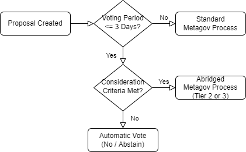

# Aave - Asset Listing Consideration Framework

## Aave Asset Listing Consideration Framework

This is a Request For Comment from the RabbitHole Metagovernance Pod regarding consideration criteria for proposals to create new asset markets on Aave. - Published by [rathermercurial.eth](https://rathermercurial.eth.xyz) on 2/24/22.

### Background

Over the past several weeks we've seen considerable asymmetry and volatility in both the quantity and consistency of governance proposals submitted to RH partner protocols. While some level of chaos should be expected, certain proposals can potentially strain metagovernance processes and contribute to voter disinterest / apathy.

This RFC is specifically related to new asset listing proposals on Aave, but could be applied to other similar protocols like Compound. As Mel.eth shared in the recent fireside call, creating standards and clear expectations around governance processes should be a priority when building metagov orgs such as this one. A basic framework of governance standards could promote more efficient metagovernance and better community alignment / engagement.

### Proposal Consideration Criteria

#### Voting Period Duration

A 4-Day minimum voting period would ensure the metagov pod and community (within RH and other MG orgs) have adequate time to meaningfully consider and vote on the vast majority of proposals at our current cadence

A 3-day minimum would likely be sufficient for most proposals, but the metagov process may be prone to breakdown due to short delays like holidays, outages, failure to deliver, etc. This risk could be mitigated by increasing the efficiency of the metagov process by \~25% (a seemingly realistic v1 -> v0 goal).

#### Contract Upgradeability

Contract upgradability is a risk to consider within liquidity protocols, but proper discussion and due diligence around this topic can be particularly time consuming.

If a minting contract is upgradeable via the protocol's multisig, this should be considered when assessing a proposal for consideration.

#### Collateral Eligibility

Many new assets listed on Aave have implemented a "safe mode" in which the asset cannot be used as collateral for new loans, but can be borrowed from the protocol. This allows new markets to form while reducing the overall risk to Aave and its users.

If a new asset listing does not implement a "safe mode" (i.e. asset is enabled as collateral at the time of listing), this should also be considered when assessing a proposal for consideration.

#### Other Factors

Other factors should be considered when assessing a proposal's eligibility for consideration in order to best provide a well-informed and holistic assessment, and to avoid hasty reactions to otherwise legitimate and valuable assets:

* Market Cap & TVL Benchmarks
* Chainlink Price Oracle Availability
* Reception in Aave Governance Forum
* Network Effects and Other Market Factors

### Execution Outcome

Good governance and community alignment could best be served by publishing (and adhering to) a pre-determined process for voting on unsatisfactory asset listing proposals. This would provide clarity for the metagov pod and MGC, as well as promoting transparency and accountability to the community.

Should the community disagree with the decisions of RH metagov, the consideration framework could simply be altered to suit the needs of the community rather than resorting to politics, arguing, finger-pointing or other forms of drama. Recent Web3 sentiment also indicates a strong desire for standards and expectations around metagovernance committees.

#### Automatic Vote Execution

**Abstain**

An automatic decision to simply abstain from voting would remove the proposal from the metagovernance process entirely. Abstinence would add efficiency to the metagovernance process and prevent scheduling bottlenecks in the metagov workflow, at the expense of overall effectiveness.

**Vote "No"**

An automatic "No" vote a proposal would circumvent the normal metagovernance process, but would still require action by signers of the RH multisig. Voting "No" would add considerable efficiency to the metagov process, while also signaling to authors that their proposal does not meet RH's consideration criteria.

Over time, voting "No" could encourage proposal authors to adopt higher standards for their own submissions in order to avoid "No" votes and to earn the consideration of RabbitHole and other metagovernance bodies.

#### Abridged Metagovernance Process (Tiered Voting)

As an alternative (or addition) to automatic vote execution, criteria for the consideration of asset listings (and other types of proposals) could be incorporated into the proposed Tiered Voting system during Metagov v.1.

New asset listings are currently defined as **medium** or **high** risk by the (WIP) tiering criteria, depending on the asset's proposed collateral factor. For **medium** risk proposals, the current tiering criteria should be sufficient to manage metagov pod and community workload. **High** risk proposals may benefit from automatic "no" votes due to the danger of protocol risks and other considerations which require a high degree of due diligence within an unrealistic time frame.

### Good Governance Considerations

To ensure that RH Metagov is responsibly exercising its governance weight, it's crucial that any metagovernance standards serve the greatest benefit to our partner DAO's, and not just the efficiency of RH's metagovernance process.

Efforts should be made to foster open communication with partner DAO's, adapt metagovernance processes to best suit both internal and external needs, and conform to governance standards set by external DAO's (such as Aave's recent standards around deployments to new networks).

#### Communication in Governance Forums

In alignment with RabitHole Metagov's core values of "Participation > Speculation" and "Merit > Signal", ongoing effort should be made to openly communicate RH's standards and motivations in Aave's public governance forums.

Protocol specialists and dual contributors should be active on Aave's Governance forums and attempt to communicate Rabbithole's consideration criteria and motives to proposers _during the RFC stage_. This could help set a standard for responsible metagovernance while also encouraging proposers to construct considerate, responsible AIP's.

If "No" votes are automatically executed on non-conformant proposals, it's especially important that the Aave community is able to accurately interpret Rabbithole's motivation for an early "No" vote. Otherwise, RH could be seen as disruptive to Aave's governance process or adversarial toward particular projects/protocols. This risk could be mitigated by providing clear and specific rationale for all governance decisions.

#### Sharing and Aligning Open-Source MG Standards

Metagovernance in Web3 is a nascent space and sharing of processes and standards is crucial to promote cohesion and evolution across the governance ecosystem. Wherever possible, RabbitHole should document, open-source and publicize its own standards for public good. By building and iterating on open standards for governance, RabbitHole can set a positive, useful example to other governance orgs.

In cases where other orgs have developed relevant standards for metagovernance, we should consider adopting and adapting these standards if they are beneficial to RabbitHole. Doing so should help RH Metagov proactively mitigate governance risks and mistakes previously encountered by others, as well as promoting open community standards for metagovernance.

#### Special Consideration of Edge Cases

Not all assets and proposals are created equally, and so discretion should be applied to the consideration of all asset listing proposals. Care should be taken when determining whether an asset should really be disqualified from consideration or fast-tracked through the metagovernance process.

For example: A novel, reputable stablecoin which is adopted by several DeFi protocols (such as FEI) should not be excluded from consideration simply due to a 3-day voting period. Instead, such a proposal should be given priority attention rather than be excluded from consideration.

#### Limitation of Hypocrisy (selfdogfood)

In cases where RabbitHole uses its governance power to create external proposals to partner DAO's, such internally-generated proposals should conform to the same criteria by which external proposals are judged.

For example: If RH Metagov determines that all new asset listing proposals on Aave should have a 4-Day minimum voting period in order to allow adequate time for metagovernance, RH should not sponsor such a proposal in Aave with a 3-day voting window (even though a 3-day voting period is historically acceptable according to Aave's own standards).
