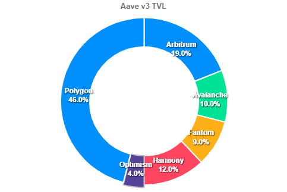

# Strategic Partnership Analysis: Aave x Curve Finance (Revision)

<mark style="background-color:yellow;">This analysis explores opportunities to leverage Aave's CVX holdings to incentivize liquidity on Optimism, as part of a sustainable multichain TVL strategy.</mark>

### Aave x Curve Multichain TVL strategy

A collaboration between Aave and Curve would lay groundwork for aToken utilization across many chains <mark style="background-color:yellow;">to which Aave v3 will be deploying</mark>. <mark style="color:orange;background-color:orange;">(Consider using active phrasing and condensing these two sentences into one</mark> 👉<mark style="color:orange;background-color:orange;">)</mark> There has been [talk](https://governance.aave.com/t/arc-consolidate-aave-v1-v2-amm-reserve-factors-purchase-cvx-and-deploy-to-earn-yield/6797) of acquiring 70,000 $CVX within the Aave governance forums lately. The aforementioned accrual of $CVX will give Aave a significant voice in Convex's governance, thus a major voice in the [Curve Wars](https://rekt.news/curve-wars/). Aave has the opportunity to incentivize aTokens across multiple chains by way of $CRV emissions for aPools. This not will both increase aToken utility across various chains, as well as increase Aave v3 TVL across various chains.

<mark style="background-color:red;">This would Aave acquires the aforementioned amount of $CVX</mark>, Aave can then [create a gauge](https://curve.fi/factory/create\_gauge) within Curve for aToken pools on chains that are either A) underperforming expectations in terms of TVL, or B) Aave v3 new launches. After creating the gauge, Aave's Convex holdings could then be used to vote on directing $CRV emissions to aPools on chains that Aave would like to grow their v3 markets on. In short, the Convex purchased can be utilized in a way that incentivizes deposits of aTokens within Curve, on specific chains that benefit Aave.

As seen above, Polygon is claiming around 46% of Aave v3 TVL. While these times are unique in the fact that most chains (excluding Harmony and Avalanche) do not have rewards incentivizing deposits.

For this example, let's use Optimism as it is currently underperforming relative to other Aave v3 Markets.

#### Strategy Overview

1. Launch aPool on [Curve](https://optimism.curve.fi) (Optimism), comprised of (for example) aUSDC, aDAI, aUSDT.
2. [Deploy Gauge](https://curve.fi/factory/create\_gauge) for aPool on Optimism (Must be done on Ethereum Mainnet).
3. Propose the [addition of Optimism aToken pool gauge](https://docs.convexfinance.com/convexfinance/general-information/voting-and-gauge-weights) in [Convex Governance](https://vote.convexfinance.com/#/).
4. Vote in Convex's gauge proposals to direct $CRV emissions to the aPool on Optimism.

This strategy can be repeated for any new v3 (or underperforming) markets that Curve is deployed on.

### Benefits for Aave Ecosystem

By utilizing (future) Aave $CVX holdings, Aave can direct $CRV emissions to chains as needed. In theory, these emissions will incentivize new and existing users to supply their tokens and receive aTokens on the Aave v3 markets that are in need of liquidity (v3 portals will make the transition relatively seamless). Additionally, this will attract new users across these chains to the Aave platform in order to earn yield within Curve. This strategy also increases overall utility of the aTokens.

### Risks to Aave Protocol

This strategy adds minimal risk to the existing practices of Aave. Instead of using the $CVX voting power to direct $CRV emissions on Ethereum, $CVX holdings would strategically be used to grow Aave v3 TVL on new chains.

<mark style="background-color:yellow;">There is an economical risk of: Upon moving $CRV emissions, Aave v3 market losing said emissions would lose a portion of TVL</mark> (users 'teleporting' tokens to new chain in order to gain $CRV emissions).

_Note: There are still remaining risks involved with Convex (centralization of Curve voting power)._

### Aave Governance Requirements

<mark style="background-color:orange;">(Consider using active phrasing here 👉)</mark> An ARC would need to be submitted to the Aave community in order to gather relevant feedback. Additionally, a Snapshot would be useful in order to gauge community sentiment regarding this strategy.

<mark style="background-color:yellow;">Bi-weekly or monthly adjustments to the Convex gauge voting strategy would be needed</mark> in order to reflect Aave's current needs, and to maintain effectiveness. Governance forum discussions and Snapshot votes would suffice for this as it has no changes taking place directly on the Aave protocol.

#### Relevant Links

[Aave Forum: Add Convex to Aave](https://snapshot.org/#/aave.eth/proposal/0x399300d33120f63cdda37068b46e5da8485dbeeb1100dab0367a223124798f5b)

[Aave Forum: Purchase Convex Earn Yield](https://governance.aave.com/t/arc-consolidate-aave-v1-v2-amm-reserve-factors-purchase-cvx-and-deploy-to-earn-yield/6797)
